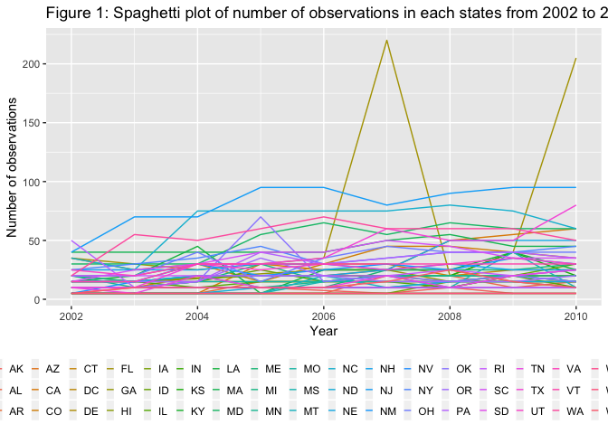
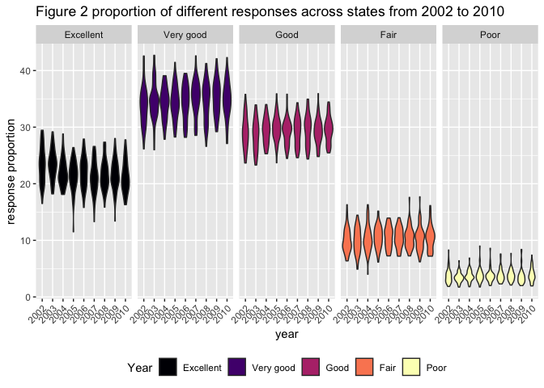
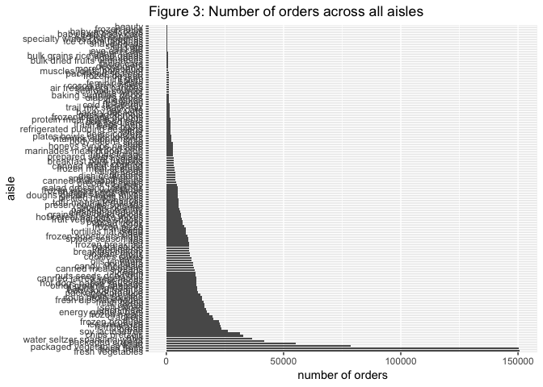
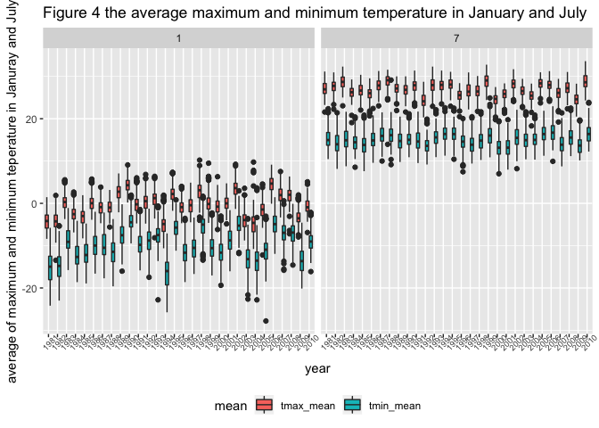
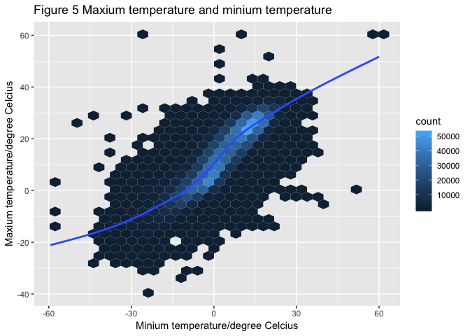
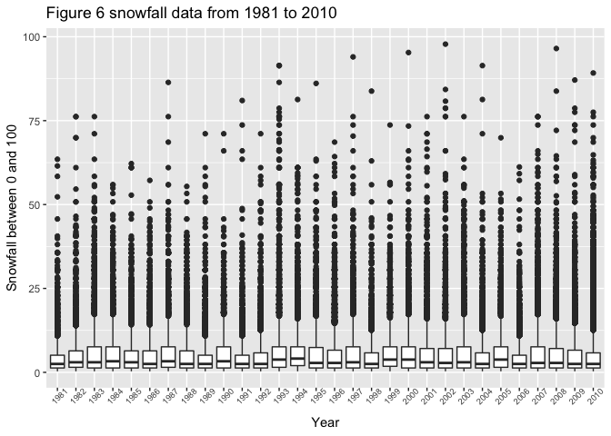

P8105\_hw3\_yx2510
================
Yi Xiao
06/10/2018

``` r
library(tidyverse)
```

    ## ── Attaching packages ────────────────────────────────────────────────────────────────── tidyverse 1.2.1 ──

    ## ✔ ggplot2 3.0.0     ✔ purrr   0.2.5
    ## ✔ tibble  1.4.2     ✔ dplyr   0.7.6
    ## ✔ tidyr   0.8.1     ✔ stringr 1.3.1
    ## ✔ readr   1.1.1     ✔ forcats 0.3.0

    ## ── Conflicts ───────────────────────────────────────────────────────────────────── tidyverse_conflicts() ──
    ## ✖ dplyr::filter() masks stats::filter()
    ## ✖ dplyr::lag()    masks stats::lag()

``` r
library(magrittr)
```

    ## 
    ## Attaching package: 'magrittr'

    ## The following object is masked from 'package:purrr':
    ## 
    ##     set_names

    ## The following object is masked from 'package:tidyr':
    ## 
    ##     extract

``` r
library(hexbin)
```

problem one
===========

load the data

``` r
brfss_data = p8105.datasets::brfss_smart2010 %>% 
  janitor::clean_names() %>%
  rename(state = locationabbr, county_state = locationdesc) %>%
  filter(topic == "Overall Health") %>% # focus on overall health
  filter(response %in% c("Excellent", "Very good", "Good", "Fair", "Poor")) %>%
  mutate(response = factor(response, levels = c("Excellent", "Very good", "Good", "Fair", "Poor")))
  
brfss_data
```

    ## # A tibble: 10,625 x 23
    ##     year state county_state class topic question response sample_size
    ##    <int> <chr> <chr>        <chr> <chr> <chr>    <fct>          <int>
    ##  1  2010 AL    AL - Jeffer… Heal… Over… How is … Excelle…          94
    ##  2  2010 AL    AL - Jeffer… Heal… Over… How is … Very go…         148
    ##  3  2010 AL    AL - Jeffer… Heal… Over… How is … Good             208
    ##  4  2010 AL    AL - Jeffer… Heal… Over… How is … Fair             107
    ##  5  2010 AL    AL - Jeffer… Heal… Over… How is … Poor              45
    ##  6  2010 AL    AL - Mobile… Heal… Over… How is … Excelle…          91
    ##  7  2010 AL    AL - Mobile… Heal… Over… How is … Very go…         177
    ##  8  2010 AL    AL - Mobile… Heal… Over… How is … Good             224
    ##  9  2010 AL    AL - Mobile… Heal… Over… How is … Fair             120
    ## 10  2010 AL    AL - Mobile… Heal… Over… How is … Poor              66
    ## # ... with 10,615 more rows, and 15 more variables: data_value <dbl>,
    ## #   confidence_limit_low <dbl>, confidence_limit_high <dbl>,
    ## #   display_order <int>, data_value_unit <chr>, data_value_type <chr>,
    ## #   data_value_footnote_symbol <chr>, data_value_footnote <chr>,
    ## #   data_source <chr>, class_id <chr>, topic_id <chr>, location_id <chr>,
    ## #   question_id <chr>, respid <chr>, geo_location <chr>

### questions

#### 1. In 2002, which states were observed at 7 locations?

``` r
brfss_data %>% 
  filter(year == "2002") %>%
  group_by(state) %>%
  summarize(location_num = n_distinct(geo_location)) %>%
  filter(location_num == 7) %>%
  knitr::kable()
```

| state    |                                               location\_num|
|:---------|-----------------------------------------------------------:|
| CT       |                                                           7|
| FL       |                                                           7|
| NC       |                                                           7|
| There ar |  e three states satisfy the standard, which are CT, FL, NC.|

#### 2. Make a “spaghetti plot” that shows the number of observations in each state from 2002 to 2010.

``` r
brfss_data %>% 
  group_by(state, year) %>% 
  summarize(n_observ = n()) %>%  # compute the number of observations on each state in the given year
  ggplot(aes(x = year, y = n_observ)) +  # make a plot
      geom_line(aes(color = state)) + 
      labs(  
        title = "Figure 1: Spaghetti plot of number of observations in each states from 2002 to 2010",               x = "Year", 
        y = "Number of observations") + 
      theme(
                  legend.position = "bottom",
                  legend.key.width = unit(.1, "in")
               ) + 
     guides(color = guide_legend(ncol = 20)) 
```

 Figure 1 shows the number of observations for each states and most states have less than 10 observations. Florida is the only state having more than 20 observations. The number in Florida flucuated a lot while observations in the rest states are relatively constant.

#### 3. Make a table showing, for the years 2002, 2006, and 2010, the mean and standard deviation of the proportion of “Excellent” responses across locations in NY State.

``` r
filter(brfss_data, 
       state == "NY",
       year %in% c(2002, 2006, 2010),
       response == "Excellent") %>%
  group_by(year) %>% 
  summarize(excel_sd = sd(data_value, na.rm = TRUE),
            excel_mean = mean(data_value, na.rm = TRUE)) %>% 
  knitr::kable(digits = 2)
```

|     year|   excel\_sd|                                        excel\_mean|
|--------:|-----------:|--------------------------------------------------:|
|     2002|        4.49|                                              24.04|
|     2006|        4.00|                                              22.53|
|     2010|        3.57|                                              22.70|
|  The pro|  portion of|  excellence decrease over those years in NY state.|

#### For each year and state, compute the average proportion in each response category (taking the average across locations in a state). Make a five-panel plot that shows, for each response category separately, the distribution of these state-level averages over time.

``` r
brfss_data %>%
        group_by(year, state, response) %>%
        summarise(response_mean = mean(data_value, na.rm = TRUE)) %>% # calculate the proportion for each
        ggplot(aes(x = factor(year), y = response_mean)) +         # response in the give year and state
        geom_violin(aes(fill = factor(response))) +
        facet_grid(. ~ response) +                                 # make a 5-panel plot
        labs(
             title = "Figure 2 proportion of different responses across states from 2002 to 2010",
             x = "year",
             y = "response proportion"
        ) +
        theme(legend.position = "bottom", 
               axis.text.x = element_text(angle = 45, hjust = 1)) +
         viridis::scale_fill_viridis(name = "Year",
                                discrete = TRUE, 
                                option = "magma") 
```

 Figure 2 shows the desity of the different response rate across states from 2002 to 2010. The proportion of response increased from poor to very good and drop a little when it comes to excellent. The proportion of responses also remained stable over the investigated period.

problem 2
=========

load and clean the data

``` r
instacrat_data = p8105.datasets::instacart %>%
        janitor::clean_names() 
head(instacrat_data)
```

    ## # A tibble: 6 x 15
    ##   order_id product_id add_to_cart_ord… reordered user_id eval_set
    ##      <int>      <int>            <int>     <int>   <int> <chr>   
    ## 1        1      49302                1         1  112108 train   
    ## 2        1      11109                2         1  112108 train   
    ## 3        1      10246                3         0  112108 train   
    ## 4        1      49683                4         0  112108 train   
    ## 5        1      43633                5         1  112108 train   
    ## 6        1      13176                6         0  112108 train   
    ## # ... with 9 more variables: order_number <int>, order_dow <int>,
    ## #   order_hour_of_day <int>, days_since_prior_order <int>,
    ## #   product_name <chr>, aisle_id <int>, department_id <int>, aisle <chr>,
    ## #   department <chr>

This dataset contains data on online store orders during 2017. There are 1384617 observations and 15 columns. Some key variables include product\_id, product\_name, day and date, reorder times.

questions
---------

#### 1.How many aisles are there, and which aisles are the most items ordered from?

``` r
n_distinct(instacrat_data$aisle, na.rm = TRUE)
```

    ## [1] 134

There are 134 distinct aisles.

``` r
items = instacrat_data %>%
        group_by(aisle) %>%
        summarise(aisle_num = n()) %>%
        arrange(desc(aisle_num))
items
```

    ## # A tibble: 134 x 2
    ##    aisle                         aisle_num
    ##    <chr>                             <int>
    ##  1 fresh vegetables                 150609
    ##  2 fresh fruits                     150473
    ##  3 packaged vegetables fruits        78493
    ##  4 yogurt                            55240
    ##  5 packaged cheese                   41699
    ##  6 water seltzer sparkling water     36617
    ##  7 milk                              32644
    ##  8 chips pretzels                    31269
    ##  9 soy lactosefree                   26240
    ## 10 bread                             23635
    ## # ... with 124 more rows

Fresh vegetables is the aisle with the most item bought from.

#### 2. Make a plot that shows the number of items ordered in each aisle. Order aisles sensibly, and organize your plot so others can read it.

Since 134 aisles are contained in the dataset, we first divide them into seveal groups for better display.

``` r
instacrat_data %>%
  group_by(aisle) %>%
  summarize(n = n()) %>%
  arrange(desc(n)) %>% 
  mutate(aisle = forcats::fct_reorder(aisle, n, .desc = TRUE)) %>% 
  ggplot(aes(x = aisle, y = n)) + 
    coord_flip() + 
    geom_bar(stat = "identity") +
    labs(y = "number of orders", 
         x = "aisle", 
        title = "Figure 3: Number of orders across all aisles" ) 
```



``` r
    ggsave(filename = "# of order.png", height = 30, units = "cm")
```

    ## Saving 17.8 x 30 cm image

#### 3.Make a table showing the most popular item aisles “baking ingredients”, “dog food care”, and “packaged vegetables fruits”

``` r
instacrat_data %>%
        filter(aisle %in% c("baking ingredients", "dog food care", "packaged vegetables fruits")) %>%
        group_by(aisle, product_name) %>%
        summarise(pro_num = n()) %>%
        filter(pro_num == max(pro_num)) %>%
        arrange(desc(pro_num)) %>%
       rename( "Product Name" = product_name, 
         "Number of Orders" = pro_num) %>%
        knitr::kable()
```

| aisle                      | Product Name                                  |  Number of Orders|
|:---------------------------|:----------------------------------------------|-----------------:|
| packaged vegetables fruits | Organic Baby Spinach                          |              9784|
| baking ingredients         | Light Brown Sugar                             |               499|
| dog food care              | Snack Sticks Chicken & Rice Recipe Dog Treats |                30|

#### 4. Make a table showing the mean hour of the day at which Pink Lady Apples and Coffee Ice Cream are ordered on each day of the week; format this table for human readers (i.e. produce a 2 x 7 table).

``` r
instacrat_data %>% 
    filter(product_name %in% c("Pink Lady Apples", "Coffee Ice Cream")) %>% 
    group_by(product_name, order_dow) %>% 
    summarize(mean_hour = mean(order_hour_of_day)) %>%
    spread(key = order_dow, value = mean_hour) %>% 
    knitr::kable(digits = 2)
```

| product\_name    |      0|      1|      2|      3|      4|      5|      6|
|:-----------------|------:|------:|------:|------:|------:|------:|------:|
| Coffee Ice Cream |  13.77|  14.32|  15.38|  15.32|  15.22|  12.26|  13.83|
| Pink Lady Apples |  13.44|  11.36|  11.70|  14.25|  11.55|  12.78|  11.94|

problem 3
=========

load the data first

``` r
noaa_data = p8105.datasets::ny_noaa %>%
janitor::clean_names()
str(noaa_data)
```

    ## Classes 'tbl_df', 'tbl' and 'data.frame':    2595176 obs. of  7 variables:
    ##  $ id  : chr  "US1NYAB0001" "US1NYAB0001" "US1NYAB0001" "US1NYAB0001" ...
    ##  $ date: Date, format: "2007-11-01" "2007-11-02" ...
    ##  $ prcp: int  NA NA NA NA NA NA NA NA NA NA ...
    ##  $ snow: int  NA NA NA NA NA NA NA NA NA NA ...
    ##  $ snwd: int  NA NA NA NA NA NA NA NA NA NA ...
    ##  $ tmax: chr  NA NA NA NA ...
    ##  $ tmin: chr  NA NA NA NA ...
    ##  - attr(*, "spec")=List of 2
    ##   ..$ cols   :List of 7
    ##   .. ..$ id  : list()
    ##   .. .. ..- attr(*, "class")= chr  "collector_character" "collector"
    ##   .. ..$ date:List of 1
    ##   .. .. ..$ format: chr ""
    ##   .. .. ..- attr(*, "class")= chr  "collector_date" "collector"
    ##   .. ..$ prcp: list()
    ##   .. .. ..- attr(*, "class")= chr  "collector_integer" "collector"
    ##   .. ..$ snow: list()
    ##   .. .. ..- attr(*, "class")= chr  "collector_integer" "collector"
    ##   .. ..$ snwd: list()
    ##   .. .. ..- attr(*, "class")= chr  "collector_integer" "collector"
    ##   .. ..$ tmax: list()
    ##   .. .. ..- attr(*, "class")= chr  "collector_character" "collector"
    ##   .. ..$ tmin: list()
    ##   .. .. ..- attr(*, "class")= chr  "collector_character" "collector"
    ##   ..$ default: list()
    ##   .. ..- attr(*, "class")= chr  "collector_guess" "collector"
    ##   ..- attr(*, "class")= chr "col_spec"

``` r
head(noaa_data)
```

    ## # A tibble: 6 x 7
    ##   id          date        prcp  snow  snwd tmax  tmin 
    ##   <chr>       <date>     <int> <int> <int> <chr> <chr>
    ## 1 US1NYAB0001 2007-11-01    NA    NA    NA <NA>  <NA> 
    ## 2 US1NYAB0001 2007-11-02    NA    NA    NA <NA>  <NA> 
    ## 3 US1NYAB0001 2007-11-03    NA    NA    NA <NA>  <NA> 
    ## 4 US1NYAB0001 2007-11-04    NA    NA    NA <NA>  <NA> 
    ## 5 US1NYAB0001 2007-11-05    NA    NA    NA <NA>  <NA> 
    ## 6 US1NYAB0001 2007-11-06    NA    NA    NA <NA>  <NA>

The dataset contains weather information for 5 weather station in New York from 1981 to 2010. The dataset has 2595176 observations and 7 variables including information on date, precipitation, snow and snow depth in millimeters, maximum and minimum temperature in degree celcucius. All of the variables have missing values except id and date. The proportion of some variables are as follows : prcp: 0.0561958, snow: 0.146896, snwd: 0.2280331, which can be an issue when we do data analysis.

questions
---------

#### 1. Do some data cleaning. Create separate variables for year, month, and day. Ensure observations for temperature, precipitation, and snowfall are given in reasonable units. For snowfall, what are the most commonly observed values? Why?

``` r
# do some data cleaning
noaa_tidy_data =
        separate(noaa_data, date, into = c("year", "month", "day"), sep = "-") %>%
        mutate(prcp = prcp/10,
               snow = snow/10, 
               tmin = as.integer(tmin)/10,
               tmax = as.integer(tmax)/10,
               year = as.integer(year),
               month = as.integer(month),
               day = as.integer(day)
        ) 
noaa_tidy_data
```

    ## # A tibble: 2,595,176 x 9
    ##    id           year month   day  prcp  snow  snwd  tmax  tmin
    ##    <chr>       <int> <int> <int> <dbl> <dbl> <int> <dbl> <dbl>
    ##  1 US1NYAB0001  2007    11     1    NA    NA    NA    NA    NA
    ##  2 US1NYAB0001  2007    11     2    NA    NA    NA    NA    NA
    ##  3 US1NYAB0001  2007    11     3    NA    NA    NA    NA    NA
    ##  4 US1NYAB0001  2007    11     4    NA    NA    NA    NA    NA
    ##  5 US1NYAB0001  2007    11     5    NA    NA    NA    NA    NA
    ##  6 US1NYAB0001  2007    11     6    NA    NA    NA    NA    NA
    ##  7 US1NYAB0001  2007    11     7    NA    NA    NA    NA    NA
    ##  8 US1NYAB0001  2007    11     8    NA    NA    NA    NA    NA
    ##  9 US1NYAB0001  2007    11     9    NA    NA    NA    NA    NA
    ## 10 US1NYAB0001  2007    11    10    NA    NA    NA    NA    NA
    ## # ... with 2,595,166 more rows

``` r
# find the most common value for snowfall
noaa_tidy_data %>%
        group_by(snow) %>%
        summarise(snow_frequency = n()) %>%
        arrange(desc(snow_frequency)) %>%
        top_n(1)
```

    ## Selecting by snow_frequency

    ## # A tibble: 1 x 2
    ##    snow snow_frequency
    ##   <dbl>          <int>
    ## 1     0        2008508

The most common value is 0.

#### 2.Make a two-panel plot showing the average temperature in January and in July in each station across years. Is there any observable / interpretable structure? Any outliers?

``` r
noaa_tidy_data %>%
        filter(month == 1 | month == 7) %>%
        group_by(id, year, month) %>%
        summarise(tmax_mean = round(mean(tmax, na.rm = TRUE), 2), 
                  tmin_mean = round(mean(tmin, na.rm = TRUE), 2)) %>%
        gather(key = mean, value = mean_temperature, tmax_mean:tmin_mean) %>%
        ggplot(aes(x = as.factor(year), y = mean_temperature, fill = mean)) +
        geom_boxplot() +
        facet_grid(~ month) +
        theme(legend.position = "bottom") +
        theme(axis.text.x = element_text(size = 7, angle = 45)) +
        labs( x = "year",
              y = "average of maximum and minimum teperature in Januray and July",
              title = "Figure 4 the average maximum and minimum temperature in January and July")
```

    ## Warning: Removed 11939 rows containing non-finite values (stat_boxplot).

 Figure 4 shows the average minimum and maximum temperature in New York in January and July. We can know from the plot that there is greater variation in the average temperature in January over the period.

#### 3.Make a two-panel plot showing:

1.  tmax vs tmin for the full dataset (note that a scatterplot may not be the best option).

``` r
noaa_tidy_data %>%
        ggplot(aes(x = tmin, y = tmax)) +
        geom_hex() +
        labs(
        title = "Figure 5 Maxium temperature and minium temperature",
        y = "Maxium temperature/degree Celcius",
        x = "Minium temperature/degree Celcius"
    ) +
        geom_smooth(se = FALSE)
```

    ## Warning: Removed 1136276 rows containing non-finite values (stat_binhex).

    ## `geom_smooth()` using method = 'gam' and formula 'y ~ s(x, bs = "cs")'

    ## Warning: Removed 1136276 rows containing non-finite values (stat_smooth).

 Figure 5 shows the relationship between the minimum and maximum temperature. We can see there is a positive correlation between the minimum temperature and the maximum temperature.

1.  make a plot showing the distribution of snowfall values greater than 0 and less than 100 separately by year

``` r
noaa_tidy_data %>%
        filter(snow > 0 & snow < 100) %>%
        ggplot(aes(x = as.factor(year), y = snow)) +
        geom_boxplot() +
        labs(
                x = "Year",
                y = "Snowfall between 0 and 100",
                title = "Figure 6 snowfall data from 1981 to 2010 "
        ) +
        theme(axis.text.x = element_text(size = 7, angle = 45))
```

 We can see from Figure 6 that the snow distribution in every year is similar.
